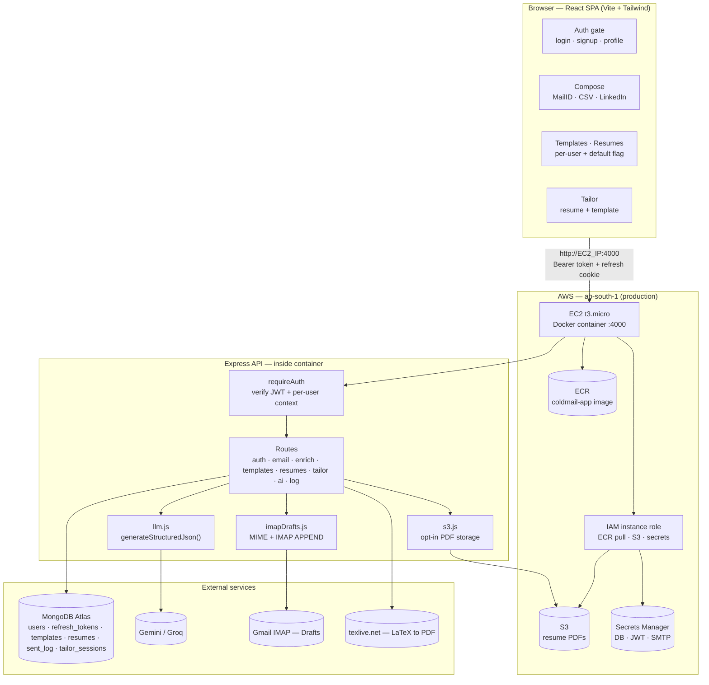
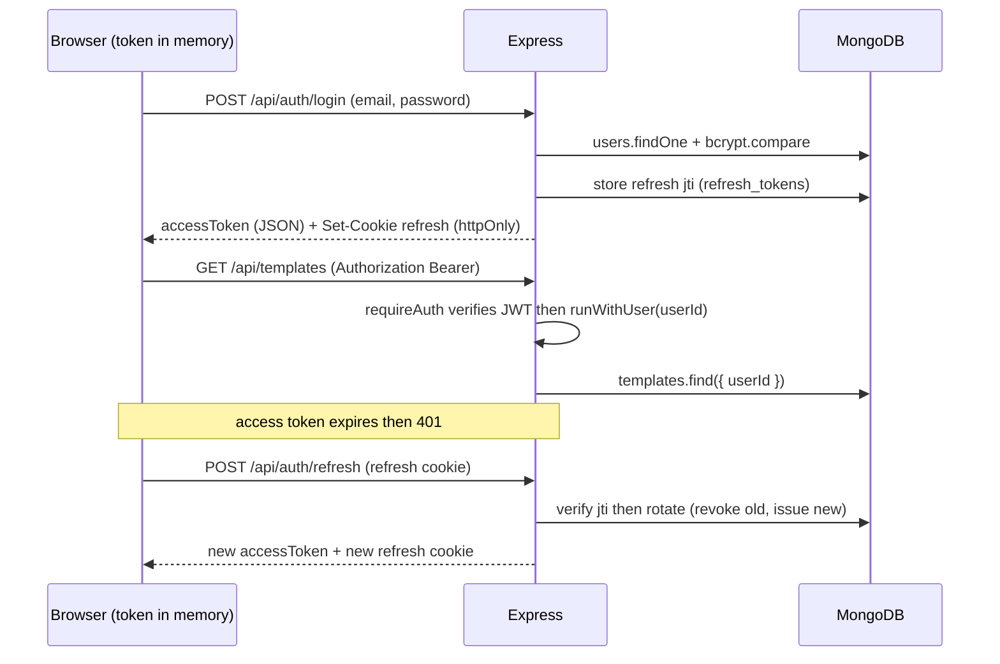
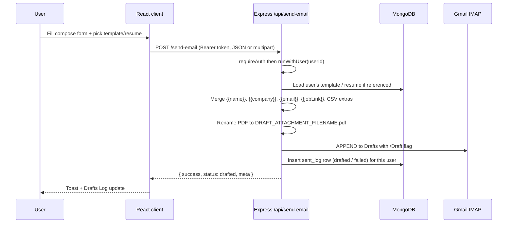
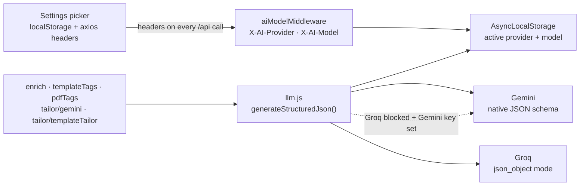
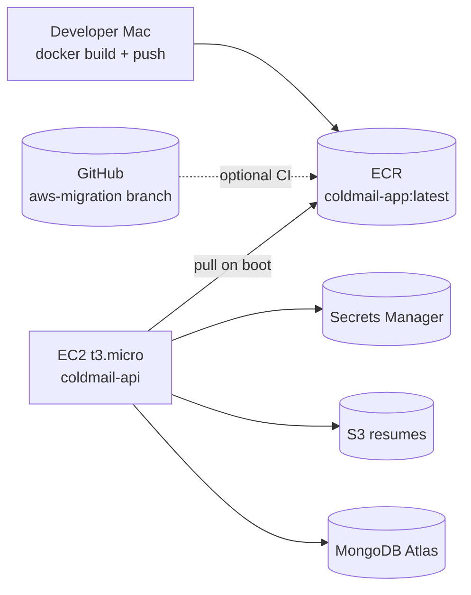

# coldMail — Project Details

Architecture, data flows, auth, AI, and deployment. For setup, see [README.md](./README.md).

## Contents

- [Overview](#overview)
- [High-level architecture](#high-level-architecture)
- [Auth and per-user data](#auth-and-per-user-data)
- [Request flow — saving a draft](#request-flow--saving-a-draft)
- [AI architecture](#ai-architecture)
- [MongoDB collections](#mongodb-collections)
- [Deployment (AWS EC2)](#deployment-aws-ec2)
- [Security](#security)
- [Development](#development)

---

## Overview

**coldMail** is a multi-user cold-email workbench. Each user maintains their own library of HTML templates and PDF resumes, composes personalised outreach in three input modes (MailID / CSV / LinkedIn), optionally lets AI pick or tailor content to a job description, and saves every message as a **Gmail draft** (via IMAP).

React + Express monorepo, **MongoDB Atlas** persistence, JWT auth, and a unified LLM layer over **Gemini** and **Groq**. In production a Docker container on **AWS EC2** serves the built SPA and the API from one origin (`client/dist` + `/api/*`).

---

## High-level architecture



- **Single-origin in production:** one Docker container serves the SPA at `/` and the API at `/api/*` on port **4000**.
- **Development:** Vite (`:5173`) proxies `/api` to Express (`:4000`); CORS allows configured origins plus any localhost port, with `credentials` enabled for the refresh cookie.
- **Resume storage:** when `S3_BUCKET` is set (production), new PDFs go to S3; metadata stays in MongoDB. Without `S3_BUCKET`, PDFs are stored inline in Mongo (local dev default).

---

## Auth and per-user data

Email + password auth using JWT. The **access token** (short-lived) is held in browser memory and sent as `Authorization: Bearer`; the **refresh token** (long-lived) is an httpOnly cookie scoped to `/api/auth`, rotated on every refresh and revocable via the `refresh_tokens` store.



**Per-user scoping:** `requireAuth` runs the request inside an `AsyncLocalStorage` user context (`services/userContext.js`), mirroring the AI-model middleware. Every store (`store.js`, `resumeStore.js`, `tailor/sessionPersistence.js`) reads the current `userId` and filters/stamps queries automatically — so routes and deep tailor call-chains need no changes and users only ever see their own data.

**Defaults:** a user can mark one template and one resume as their default (`isDefault` flag, one per user). Compose auto-selects them; otherwise it starts blank.

**Admin seed:** on boot, if `SEED_ADMIN_EMAIL` + `SEED_ADMIN_PASSWORD` are set, `seed/seedAdmin.js` creates the user (if missing) and assigns any pre-existing unowned documents to it. Idempotent.

---

## Request flow — saving a draft



**Why drafts, not direct send?** IMAP `APPEND` with the `\Draft` flag avoids SMTP deliverability issues and lets you review + use Gmail's native Schedule Send. `RESEND_API_KEY` remains an optional direct-send path.

---

## AI architecture

All structured-AI calls go through one server abstraction; provider/model are chosen per request from headers.



| Feature | Endpoint | Input to model | Output |
|---------|----------|----------------|--------|
| Email patterns | `POST /enrich/email` | Company + optional domain | 5 ranked `{pattern, confidence}` |
| Name extraction | `POST /enrich/names` | Emails + company | `{candidates:[{email,name}]}` |
| JD match | `POST /enrich/jd-match` | JD + library `{id,name,tags}` only | `{templateId, resumeId}` |
| Job intake | `POST /enrich/job-intake` | Pasted JD or job URL text | `{jd, company, roleTitle}` |
| Template / resume tags | `POST /templates|resumes/suggest-tags` | Subject+body / PDF bytes | `{tags[]}` |
| Resume / template tailor | `POST /tailor/(session|template-session)` | LaTeX sections / paragraphs + JD | Ordered suggestions |

**Privacy:** JD match sends only `{id, name, tags}` — never full bodies or PDF bytes unless a feature needs it (PDF tagging, resume tailoring). **Groq notes:** OpenAI-compatible `json_object` mode; PDF analysis needs Gemini; auto-falls back to Gemini if a Groq model is project-blocked.

---

## MongoDB collections

| Collection | Contents |
|------------|----------|
| `users` | `{ id, email (unique), name, passwordHash, createdAt }` |
| `refresh_tokens` | `{ jti (unique), userId, revoked, expiresAt (TTL) }` — rotation + revocation |
| `templates` | `{ id, userId, name, subject, body, tags[], isDefault?, createdAt, updatedAt }` |
| `resumes` | `{ id, userId, name, tags[], filename, contentType, size, isDefault?, s3Key? \| content (Binary) }` — S3 when `S3_BUCKET` set, else inline PDF |
| `sent_log` | `{ id, userId, to, subject, status, sentAt, error? }` |
| `tailor_sessions` | `{ id, userId, kind, queue/applied state, expiresAt (TTL) }` |

Indexes (incl. `email` unique, `userId` compound, and TTLs) are ensured on boot in `services/db.js`.

---

## Deployment (AWS EC2)

Production runs on **AWS EC2 Free Tier** in **ap-south-1 (Mumbai)**. The app is containerized (same image locally and in the cloud), with secrets in **Secrets Manager** and resume PDFs in **S3**.

### Production topology



| AWS service | Purpose |
|-------------|---------|
| **ECR** | Stores the `coldmail-app` Docker image |
| **EC2** | Runs the container on port 4000 (t3.micro, free tier 12 months) |
| **S3** | Resume PDF storage (`coldmail-resumes-<account-id>`) |
| **Secrets Manager** | `mongodb-uri`, JWT secrets, SMTP credentials |
| **IAM** | Instance role — ECR pull, S3 read/write, Secrets read |
| **MongoDB Atlas** | Database (unchanged; allow EC2 outbound IP or `0.0.0.0/0`) |

### Console setup checklist

1. **ECR** — create repository `coldmail-app`.
2. **S3** — create bucket `coldmail-resumes-<account-id>`; block public access; enable versioning.
3. **Secrets Manager** — six secrets (plaintext value only, no `KEY=` prefix):

   | Secret name | Maps to env var at runtime |
   |-------------|---------------------------|
   | `coldmail/mongodb-uri` | `MONGODB_URI` |
   | `coldmail/jwt-access-secret` | `JWT_ACCESS_SECRET` |
   | `coldmail/jwt-refresh-secret` | `JWT_REFRESH_SECRET` |
   | `coldmail/smtp-user` | `SMTP_USER` |
   | `coldmail/smtp-pass` | `SMTP_PASS` |
   | `coldmail/mail-from` | `MAIL_FROM` |

4. **IAM role** `coldmail-ec2-instance` — trusted by **EC2**; inline policy for ECR pull, S3 object access on the resumes bucket, and `secretsmanager:GetSecretValue` on `coldmail/*`.
5. **Security group** `coldmail-sg` — inbound **22** (SSH, My IP) and **4000** (app, `0.0.0.0/0`).
6. **EC2** — Amazon Linux 2023, t3.micro, attach IAM role + security group; optional **user data** script fetches secrets, pulls from ECR, and starts the container.
7. **Elastic IP** (recommended) — stable public IP; update `CORS_ORIGIN` to `http://<elastic-ip>:4000` if the IP changes after first boot.

Optional IaC: [`infra/terraform/`](./infra/terraform/) and [`infra/README.md`](./infra/README.md) (EC2, ECR, S3, Secrets Manager; import guide for console-built resources).

### Build and push image

```bash
# From repo root (aws-migration branch)
aws ecr get-login-password --region ap-south-1 | \
  docker login --username AWS --password-stdin ACCOUNT_ID.dkr.ecr.ap-south-1.amazonaws.com

docker build -t ACCOUNT_ID.dkr.ecr.ap-south-1.amazonaws.com/coldmail-app:latest .
docker push ACCOUNT_ID.dkr.ecr.ap-south-1.amazonaws.com/coldmail-app:latest
```

### Container runtime

On first boot (user data) or via SSH, the instance:

1. Installs Docker + AWS CLI.
2. Logs into ECR using the **instance role** (no long-lived keys on the VM).
3. Fetches secrets from Secrets Manager.
4. Sets `CORS_ORIGIN=http://<public-ip>:4000`.
5. Runs `docker run -p 4000:4000 --restart unless-stopped` with all env vars.

If user data was omitted at launch, run the startup script manually over SSH (see Deployment section above).

### Verify

```bash
curl http://<ec2-public-ip>:4000/api/health
# → { "ok": true, "features": { "aiEnrich": true } }
```

Open `http://<ec2-public-ip>:4000` in a browser and log in.

### Redeploy after code changes

```bash
# Mac — rebuild and push
docker build -t ACCOUNT_ID.dkr.ecr.ap-south-1.amazonaws.com/coldmail-app:latest .
docker push ACCOUNT_ID.dkr.ecr.ap-south-1.amazonaws.com/coldmail-app:latest

# EC2 — SSH in, pull and restart container
sudo docker pull ACCOUNT_ID.dkr.ecr.ap-south-1.amazonaws.com/coldmail-app:latest
sudo docker rm -f coldmail && <docker run ...>   # same env as initial deploy
```

Optional: `.github/workflows/aws-deploy.yml` pushes to ECR on every `aws-migration` push (requires `AWS_DEPLOY_ROLE_ARN` secret). Redeploy on EC2 via SSH (`docker pull` + restart).

### Cost (approximate)

| Resource | Monthly |
|----------|---------|
| EC2 t3.micro | ~$0 (free tier, 12 months) |
| Secrets Manager (6 secrets) | ~$2.40 |
| S3 + ECR | ~$0–1 (low usage) |
| **Total** | **~$3–4/month** |

### Local production smoke test

```bash
npm run build
NODE_ENV=production node server/src/index.js   # SPA + API on :4000
# or: docker build -t coldmail:local . && docker run --rm -p 4000:4000 --env-file server/.env coldmail:local
```

---

## Security

- **Auth** — bcrypt password hashing; JWT access token in memory + httpOnly refresh cookie with rotation, reuse-detection, and server-side revocation (`refresh_tokens`).
- **Per-user isolation** — `requireAuth` + `AsyncLocalStorage` scope every store query to the owner; id-based reads/writes verify ownership.
- **helmet** — security headers (CSP disabled so Vite bundles + sandboxed previews work). **CORS** — allowlist via `CORS_ORIGIN`, `credentials` enabled for the refresh cookie.
- **Rate limiting** — stricter limiter on auth routes; standard limiter on send + AI routes.
- **Validation** — `validator` on auth + send endpoints.
- **Secrets** — local dev: `server/.env` (gitignored). Production: **AWS Secrets Manager**, injected at container start; never sent to the client.
- **IAM least privilege** — EC2 instance role grants only ECR pull, S3 resumes bucket, and required secrets.
- **Preview sandbox** — template preview iframe uses `sandbox`.
- **AI data minimisation** — JD match sends `{id, name, tags}` only.

---

## Development

```bash
git clone <repo> coldMail && cd coldMail
npm run install:all
cp server/.env.example server/.env   # MONGODB_URI, JWT secrets, mail creds, AI keys
npm run dev                          # API :4000 + Vite :5173 (proxies /api)
```

| Script | Action |
|--------|--------|
| `npm run install:all` | Install root + client + server deps |
| `npm run dev` | Concurrent Vite client + `--watch` server |
| `npm run build` | Build client → `client/dist` |
| `npm start` | Production: serve SPA + API |

Health check: `GET /api/health` returns `ok: true` and `features.aiEnrich: true` when an AI key is set.
